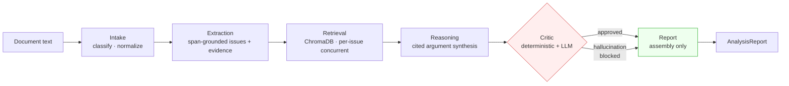

# decision-lens

> A composable, observable multi-agent pipeline that turns dense administrative decisions into grounded, citation-checked analysis reports.

**Stack:** LangGraph · LiteLLM · Instructor · Pydantic · ChromaDB · FastAPI · React 19 + TanStack Query + Tailwind v4 · Langfuse (optional) · Ragas (optional)

Provider-agnostic via LiteLLM — works with OpenAI, Anthropic, Gemini / Vertex, Bedrock, or any OpenAI-compatible endpoint by changing one env var.

---

## What this is

A six-agent pipeline for analyzing administrative decisions (denials, appellate rulings, regulatory letters). Every agent boundary is a typed Pydantic schema; an adversarial **Critic** validates each claim against retrieved citations before output is emitted; every run produces a span trace exposed at `GET /traces/{run_id}` and rendered as a Gantt-style timeline in the UI.



**The point:** every legal claim in the final report traces back to a retrieved source the Critic actually saw. The Critic runs a deterministic dangling-source-id check **before** any LLM call, so hallucinated `[REG-PHANTOM]`-style citations never reach the LLM judge.

This is an independent portfolio implementation. No production code or proprietary data is included; all sample documents are synthetic.

## Status

✅ Phases 0–5 shipped. **48/48 tests passing.** Phase 6 (CI + demo GIF + extended docs) is in progress. See [BUILD.md](./BUILD.md).

| Phase | What | Tests |
|---|---|---|
| 0 | Schemas + FastAPI skeleton | 8 schema |
| 1 | LiteLLM provider + Intake agent + LangGraph stub | 9 intake |
| 2 | Full 6-agent DAG + ChromaDB retrieval + adversarial Critic | 23 (extraction · retrieval · reasoning · critic · report · e2e) |
| 3 | React frontend — Zod-mirrored types + 5-tab scroll-spy results | (visual) |
| 4 | In-memory trace store + AgentTimeline + optional Langfuse | 4 tracing |
| 5 | Deterministic eval suite + golden cases + EvalDashboard | 5 eval scoring |

## Quickstart

```bash
# 1. Install
python -m venv .venv && source .venv/Scripts/activate    # Windows: .venv\Scripts\activate
pip install -e ".[dev]"

# 2. Configure (any one of these)
echo "OPENAI_API_KEY=sk-..." > .env
# or:  echo -e "GEMINI_API_KEY=...\nLLM_MODEL=gemini/gemini-2.5-flash" > .env

# 3. Run the API
uvicorn api.main:app --reload --port 8000   # http://localhost:8000/docs

# 4. Run the frontend (separate terminal)
cd web && npm install && npm run dev        # http://localhost:5173
```

Open http://localhost:5173, paste any decision text (or upload `data/sample_cases/case_001_administrative_denial.txt`), click **Analyze**, then click the **Trace** tab to see span timing.

### Or via Docker

```bash
docker compose up api    # http://localhost:8000/healthz
```

### Curl the API directly

```bash
curl -X POST http://localhost:8000/analyze \
  -H "content-type: application/json" \
  -d "$(jq -n --arg t "$(cat data/sample_cases/case_001_administrative_denial.txt)" '{raw_text: $t}')"
```

Response shape: `{ "run_id": "abc123", "report": { ...AnalysisReport } }`. Then fetch `/traces/{run_id}` for the span timeline.

## Run tests

```bash
pytest -q             # full suite — 48 tests, ~14s with cold ChromaDB warm-up
```

## Run the eval suite

```bash
python scripts/run_evals.py    # writes evals/results/latest.json, exits non-zero if pass_rate < 60%
```

Five golden cases scored on five deterministic metrics that need **no LLM**:

| Metric | What it measures |
|---|---|
| `issue_recall` | fraction of expected keywords surfaced in extracted issues |
| `decision_match` | extracted decision matches the labeled `expected_decision` |
| `citation_grounding` | fraction of finding `source_id`s that resolve against retrieved citations |
| `required_source_recall` | fraction of expected `required_source_ids` that appear in citations |
| `faithfulness` | `1 − blocked_findings / total_findings` |

If `OPENAI_API_KEY` (or `LANGFUSE_PUBLIC_KEY`) is set **and** `pip install -e ".[evals]"` has been run, the runner additionally invokes Ragas's `faithfulness` LLM-as-judge metric and surfaces it in the dashboard. Without those, only the deterministic metrics run — the suite is still meaningful in CI.

## How we prevent ungrounded claims

Three concentric layers, each tested independently — a hallucinated citation has to defeat *all three* to ship in a report. They run cheapest-first so the common failure (model invents a `[REG-PHANTOM]`) is rejected at zero token cost.

| Layer | Where | What it enforces |
|---|---|---|
| 1. **Schema contract** (Pydantic, no LLM) | `api/schemas/pipeline.py` — `ReasoningFinding.supporting_source_ids: list[str] = Field(min_length=1)` | A finding without **any** cited source can never be constructed. The Instructor adapter feeds violations back to the LLM as a validation error so the model retries with a citation. |
| 2. **Reasoning post-filter** (deterministic, no LLM) | `api/agents/reasoning.py` — drops findings whose `source_id`s aren't in `RetrievalOutput.references`; partial overlaps keep only the grounded ids | A finding can't cite a source the retriever never returned. |
| 3. **Critic deterministic guard** (no LLM) | `api/agents/critic.py` — `_deterministic_dangling_check` runs *before* the LLM critic and auto-blocks any surviving dangling-id finding with a `hallucination` flag | Belt-and-suspenders for whatever slips past layer 2 (e.g. when reasoning is stubbed in tests). |

The load-bearing assertion is `tests/test_schemas.py::test_schema_rejects_finding_without_any_citation` — Pydantic's `min_length=1` is what every layer above it builds on. The hallucination-injection assertion `tests/test_critic.py::test_hallucination_injection_is_flagged_without_llm` proves layers 2–3 work even when an LLM is unavailable.

The eval suite (`api/evals/runner.py`) measures the residual on real outputs: `citation_grounding` is the fraction of finding source_ids that resolved against retrieved citations — when it's not 1.0, something escaped the three layers and the run fails the eval.

## Architecture details

### Why six agents, not one prompt

A single "analyze this document" prompt can't be evaluated component-wise. Splitting the pipeline gives every stage a typed schema, a narrow prompt, an isolated test, and a span on the trace. Failures land in one place; you can swap the model on a single stage without touching the rest.

### Soft-fail vs hard-abort

`api/agents/graph.py` — the DAG distinguishes:

- **Hard-abort (intake, critic):** failure surfaces as an HTTP 500 because the report would be uninterpretable.
- **Soft-fail (extraction, retrieval, reasoning):** the node catches its own exception, marks `ctx.poisoned=True`, appends a warning, and the graph continues. The Critic respects `poisoned` by blocking every finding.
- **Always run (report):** assembly-only — no LLM call — so it can produce a coherent report even from a poisoned context, and propagates every accumulated warning.

### Two-layer Critic

`api/agents/critic.py` — adversarial faithfulness check:

1. **Deterministic guard (no LLM):** any finding whose `supporting_source_ids` includes an id not present in `RetrievalOutput.references` is auto-blocked with a `hallucination` flag. This catches the most common failure mode (model invents a citation) at zero token cost.
2. **LLM critic:** for findings that pass the guard, an Instructor-validated LLM call returns `CriticOutput.flags[]` with `severity ∈ {block, warn, info}`. Block-severity flags drop the finding from `approved_finding_indices`. Out-of-range flag indices are filtered (the LLM occasionally returns indices for findings the deterministic guard already removed).

The hallucination-injection test (`tests/test_critic.py::test_hallucination_injection_is_flagged_without_llm`) is the load-bearing assertion — it passes with `client=None`.

### Span tracing

`api/observability/tracing.py` — every node opens a `span()` context manager via `contextvars` (so pure-function LangGraph nodes don't have to thread the trace through state). `TraceStore` is a bounded LRU (256 traces) so a process holds recent spans without a database. If `LANGFUSE_PUBLIC_KEY` is set and `langfuse` is installed, spans are also forwarded to Langfuse — best-effort, never raises into the pipeline.

### Schema-first

Every agent's input and output is a Pydantic model. The frontend mirrors them as Zod schemas in `web/src/types/api.ts` and re-validates on receipt. When a new field is added, both files change in the same PR — drift is impossible to ship without breaking either the build or the runtime parse.

## Project layout

```
api/
  agents/               intake, extraction, retrieval, reasoning, critic, report, graph
  evals/runner.py       deterministic scorer + optional Ragas wrapper
  observability/        TraceStore + span() context manager + Langfuse passthrough
  providers/llm.py      LiteLLM + Instructor wrapper
  retrieval/store.py    ChromaDB embedded mode
  schemas/              Pydantic models (pipeline.py is the source of truth)
  main.py               FastAPI: /analyze, /traces/{run_id}, /traces, /evals/latest
data/
  golden_cases.jsonl    5 labeled synthetic cases
  mock_sources/         CFR/case/policy corpus (synthetic, fictional)
  sample_cases/         human-readable demo cases
scripts/run_evals.py    CLI — exits nonzero if pass_rate < 60%
tests/                  48 tests, no live LLM required
web/                    Vite + React 19 + TS + Tailwind v4 + TanStack Query
```

## Privacy & disclaimers

All sample documents and corpus entries are **synthetic and fictional**. Party names, claim numbers, regulation numbers (`REG-3.310`, `REG-5107`, etc.), and citations in demo data are not real. This project is not affiliated with any government agency, claims-processing system, or production codebase. It is not legal advice and should not be used as such.

## License

MIT — see [LICENSE](./LICENSE).
